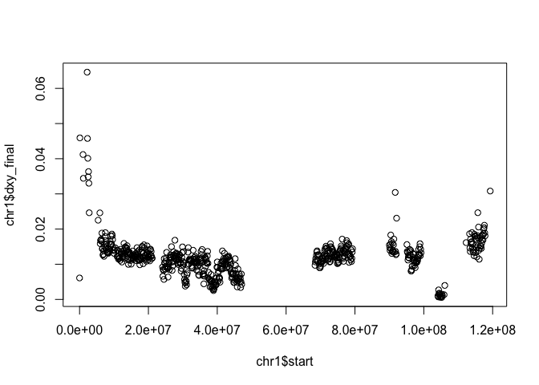

# dxy_troubleshooting
kira delmore  
july 7, 2017  


```r
setwd("~/Desktop")

files <- c("willow_warbler_dxy_orig.R","willow_warbler_dxy_095.R","willow_warbler_dxy_nomaf.R","willow_warbler_dxy_mind.R","willow_warbler_dxy.angsd.R")
stats_table <- NULL

for (i in seq_along(files)) {
  
  if (files[i]=="willow_warbler_dxy_orig.R"){
    name1="SNP pval 1e-6, GP 0.99, mind 9, maf 0.05, marker geno in 0.75 ind"
    name2="orig"
  }

  if (files[i]=="willow_warbler_dxy_095.R"){
    name1="GP 0.95, removed geno in 0.75 ind"
    name2="0.95"
  }
  
  if (files[i]=="willow_warbler_dxy_mind.R"){
    name1="reduced mind to 4"
    name2="mind"
  }
  
  if (files[i]=="willow_warbler_dxy_nomaf.R"){
    name1="removed maf cutoff"
    name2="maf"
  }
 
  if (files[i]=="willow_warbler_dxy.angsd.R"){
    name1="run with ANGSD to dxy_by_site; SNP pval 1e-6, GP 0.95 and mind 4 in each pop"
    name2="angsd"
  }

  print(name1)
  
  load(files[i])
  dxy$start<-as.numeric(as.character(dxy$start))
  dxy$overlap<-as.numeric(as.character(dxy$overlap))
  dxy$snps<-as.numeric(as.character(dxy$snps))
  dxy_filt <- dxy[dxy$overlap>5000,]

  chr1<-dxy_filt[dxy_filt$Pos=="Chromosome_1",]
  chr3<-dxy_filt[dxy_filt$Pos=="Chromosome_3",]
  chr5<-dxy_filt[dxy_filt$Pos=="Chromosome_5",]

  summary(chr1$dxy_final)
  summary(chr3$dxy_final)
  summary(chr5$dxy_final)
  
  summary(chr1$snps)
  summary(chr3$snps)
  summary(chr5$snps)

  stats_i <- c(name2,mean(chr1$dxy_final),mean(chr3$dxy_final),mean(chr5$dxy_final),mean(chr1$snps),mean(chr3$snps),mean(chr5$snps))
  stats_table <- rbind(stats_table,stats_i)
  
  plot(chr1$start,chr1$dxy_final)
  plot(chr3$start,chr3$dxy_final)
  plot(chr5$start,chr5$dxy_final)

}
```

```
## [1] "SNP pval 1e-6, GP 0.99, mind 9, maf 0.05, marker geno in 0.75 ind"
```

<!-- --><!-- --><!-- -->

```
## [1] "GP 0.95, removed geno in 0.75 ind"
```

<!-- --><!-- --><!-- -->

```
## [1] "removed maf cutoff"
```

<!-- --><!-- --><!-- -->

```
## [1] "reduced mind to 4"
```

<!-- --><!-- --><!-- -->

```
## [1] "run with ANGSD to dxy_by_site; SNP pval 1e-6, GP 0.95 and mind 4 in each pop"
```

<!-- --><!-- --><!-- -->

```r
row.names(stats_table)<-stats_table[,1]
stats_table <- as.data.frame(stats_table)
id <- c(2:7)
stats_table[,id] <- as.numeric(as.character(unlist(stats_table[,id])))
names(stats_table)<-c("conditions","mean_dxy_chr1","mean_dxy_chr3","mean_dxy_chr5","mean_nsnps_chr1","mean_nsnps_chr3","mean_nsnps_chr5")
```


```r
library(knitr)
```

```
## Warning: package 'knitr' was built under R version 3.3.2
```

```r
kable(stats_table,digits=3,format="markdown",row.names = F)
```


|conditions | mean_dxy_chr1| mean_dxy_chr3| mean_dxy_chr5| mean_nsnps_chr1| mean_nsnps_chr3| mean_nsnps_chr5|
|:----------|-------------:|-------------:|-------------:|---------------:|---------------:|---------------:|
|orig       |         0.005|         0.004|         0.005|        1465.733|        1353.668|        1490.372|
|0.95       |         0.010|         0.008|         0.010|        2448.963|        2226.000|        2484.718|
|maf        |         0.011|         0.010|         0.012|        4279.922|        3880.966|        4379.294|
|mind       |         0.010|         0.009|         0.011|        2530.941|        2298.389|        2576.560|
|angsd      |         0.012|         0.011|         0.013|        4395.966|        3970.365|        4498.416|
