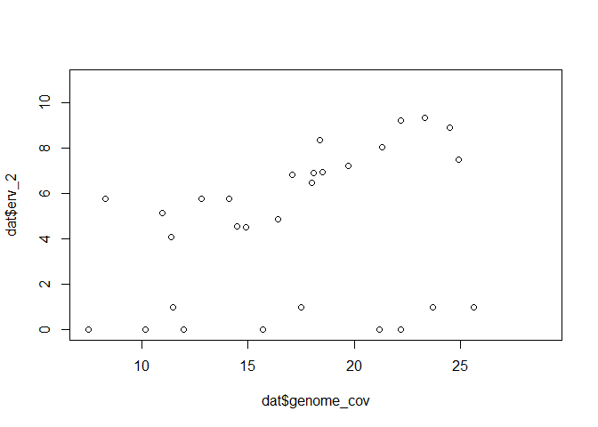

```r
library(knitr)
```

```
## Warning: package 'knitr' was built under R version 3.6.3
```

```r
dat <- read.csv("C:/Users/Kira/Dropbox/Projects_Desktop/Blackbird_Analysis/erv_coverage.csv")
```

#### average coverage for the 10 ERVs identified by censor  

```r
kable(colMeans(dat[,7:16]),col.names = c("avg_cov"), format = "markdown")
```


|       |   avg_cov|
|:------|---------:|
|erv_1  |  8.455642|
|erv_2  |  5.266484|
|erv_3  |  5.836723|
|erv_4  |  3.376046|
|erv_5  |  2.589509|
|erv_6  |  5.552774|
|erv_7  |  5.921811|
|erv_8  | 14.791845|
|erv_9  | 11.895772|
|erv_10 |  7.630252|

#### average coverage for housekeeping genes randomly selected from the genome
#### much higher then all ERVs

```r
kable(colMeans(dat[,20:24]),col.names = c("avg_cov"),  format = "markdown")
```


|                |  avg_cov|
|:---------------|--------:|
|hk_gene_scaf149 | 15.30006|
|hk_gene_scaf355 | 10.38429|
|hk_gene_scaf156 | 14.28098|
|hk_gene_scaf237 | 17.55888|
|hk_gene_scaf001 | 15.22290|

#### average genome coverage overall
#### again, much higher then all ERVs

```r
mean(dat$genome_cov)
```

```
## [1] 17.51333
```

#### coverage at the ERVs has nothing to do with phenotype

```r
kable(aggregate(dat[, 7:16], list(dat$pheno), mean), format = "markdown")
```


|Group.1 |    erv_1|    erv_2|    erv_3|    erv_4|    erv_5|    erv_6|    erv_7|    erv_8|    erv_9|   erv_10|
|:-------|--------:|--------:|--------:|--------:|--------:|--------:|--------:|--------:|--------:|--------:|
|fm      | 7.949380| 4.952226| 5.661699| 3.167977| 2.398798| 4.769298| 5.287940| 12.68695| 10.10105| 6.424435|
|s       | 8.961904| 5.580742| 6.011748| 3.584114| 2.780219| 6.336250| 6.555682| 16.89674| 13.69049| 8.836069|

#### two of the snps with high fsts are in the second ERV identified by censor

```r
plot(dat$genome_cov,dat$erv_2,ylim=c(0,11))
```

<!-- -->

#### there is a clear subset of birds at that ERV that have little to no coverage
#### this is unrelated to phenotype

```r
low_cov <- subset(dat,dat$erv_2<2)
kable(low_cov$pheno, format = "markdown")
```


|x  |
|:--|
|fm |
|fm |
|s  |
|s  |
|s  |
|s  |
|fm |
|s  |
|fm |
|s  |

#### it is like there are three variants here - deletion, 0 or 1 at the SNPs
