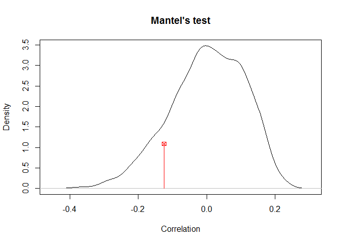

#### load libs and data

```r
library(tidyverse)
library(ecodist)
cor.tidy <- read_csv("C:/Users/Kira/Desktop/stickleback/cor_out3b.csv")
```

#### randomly sample one population from those in same watershed
#### means that we go from having 23 comparisons to 14 in matrix format
#### random.org to randomly sample 1 of each pair (yup, that's how i did it)

```r
# boot	stream
# constance	lake
# geneva	lake
# joes	stream
# lq	benthic
# misty	lake
# pax	limnetic
# pri	benthic
# roberts	lake
nrow(cor.tidy)
```

```
## [1] 267
```

```r
cor.tidy <- cor.tidy[!grepl("boot_stream", cor.tidy$pop_comp),]
cor.tidy <- cor.tidy[!grepl("constance_lake", cor.tidy$pop_comp),]
cor.tidy <- cor.tidy[!grepl("geneva_lake", cor.tidy$pop_comp),]
cor.tidy <- cor.tidy[!grepl("joes_stream", cor.tidy$pop_comp),]
cor.tidy <- cor.tidy[!grepl("lq_benthic", cor.tidy$pop_comp),]
cor.tidy <- cor.tidy[!grepl("misty_lake", cor.tidy$pop_comp),]
cor.tidy <- cor.tidy[!grepl("pax_limnetic", cor.tidy$pop_comp),]
cor.tidy <- cor.tidy[!grepl("pri_benthic", cor.tidy$pop_comp),]
cor.tidy <- cor.tidy[!grepl("roberts_lake", cor.tidy$pop_comp),]
nrow(cor.tidy)
```

```
## [1] 105
```

#### get fst matrix together
#### gregs loop

```r
pops <- sort(unique(cor.tidy$pop2))

fst <- matrix(nrow = length(pops),ncol=length(pops))
for (i in 1:length(pops)){
  for (j in 1:length(pops)){
    
    tmp<- cor.tidy %>% filter(pop1 == pops[i], pop2 == pops[j]) %>% select(Correlation) %>% .$Correlation
    if (length(tmp) == 1){
      fst[i,j] <- tmp
    }

  }
}
```

```
## Warning: package 'bindrcpp' was built under R version 3.4.4
```

```r
## have to flip this matrix
## i dont know why I can't figure this out more elegantly
fst <- apply(fst, 2, rev)
fst <- t(apply(fst, 2, rev))
fst <- as.dist(fst)
```

#### get ecology matrix together
#### binomial for now because im not sure where the qualitative variable is 
#### there are two variables it could be but both have four categories and i think should only have 3

```r
unique(cor.tidy$Ecology)
```

```
## [1] "Same_Ecology" "Diff_Ecology"
```

```r
cor.tidy$Ecology <- gsub("Same_Ecology","0",cor.tidy$Ecology)
cor.tidy$Ecology <- gsub("Diff_Ecology","1",cor.tidy$Ecology)
unique(cor.tidy$Ecology)
```

```
## [1] "0" "1"
```

```r
pops <- sort(unique(cor.tidy$pop2))

ecology <- matrix(nrow = length(pops),ncol=length(pops))
for (i in 1:length(pops)){
  for (j in 1:length(pops)){
    
    tmp<- cor.tidy %>% filter(pop1 == pops[i], pop2 == pops[j]) %>% select(Ecology) %>% .$Ecology
    if (length(tmp) == 1){
      ecology[i,j] <- tmp
    }
    
  }
}

ecology <- apply(ecology, 2, rev)
ecology <- t(apply(ecology, 2, rev))
ecology <- as.dist(ecology)
```

#### get geography matrix together
#### binomial for now because im not sure where the qualitative variable is 

```r
unique(cor.tidy$Geography)
```

```
## [1] "Same_Ocean" "Diff_Ocean"
```

```r
cor.tidy$Geography <- gsub("Same_Ocean","0",cor.tidy$Geography)
cor.tidy$Geography <- gsub("Diff_Ocean","1",cor.tidy$Geography)
unique(cor.tidy$Geography)
```

```
## [1] "0" "1"
```

```r
pops <- sort(unique(cor.tidy$pop2))

geography <- matrix(nrow = length(pops),ncol=length(pops))
for (i in 1:length(pops)){
  for (j in 1:length(pops)){
    
    tmp<- cor.tidy %>% filter(pop1 == pops[i], pop2 == pops[j]) %>% select(Geography) %>% .$Geography
    if (length(tmp) == 1){
      geography[i,j] <- tmp
    }
    
  }
}

geography <- apply(geography, 2, rev)
geography <- t(apply(geography, 2, rev))
geography <- as.dist(geography)
```

### check out the data

```r
plot(fst,ecology)
```

<!-- -->

```r
plot(fst,geography)
```

<!-- -->

#### run MRM
#### interpretation of result = both ecology and geography explain sign variation in pairwise fst
#### based on para estimates geog more impt (also if i run a simple mantel test with just fst and ecol the corr is not sign)

```r
MRM(fst~ecology+geography,nperm = 10000)
```

```
## $coef
##                   fst   pval
## Int        0.52158414 0.0001
## ecology   -0.08364946 0.0096
## geography -0.25325887 0.0001
## 
## $r.squared
##        R2      pval 
## 0.5161081 0.0001000 
## 
## $F.test
##       F  F.pval 
## 46.9294  0.0001
```

### simple mantel tests

```r
library(biotools)
```

```
## Warning: package 'biotools' was built under R version 3.4.3
```

```
## Loading required package: rpanel
```

```
## Warning: package 'rpanel' was built under R version 3.4.3
```

```
## Loading required package: tcltk
```

```
## Package `rpanel', version 1.1-3: type help(rpanel) for summary information
```

```
## 
## Attaching package: 'rpanel'
```

```
## The following object is masked from 'package:tidyr':
## 
##     population
```

```
## Loading required package: tkrplot
```

```
## Loading required package: MASS
```

```
## 
## Attaching package: 'MASS'
```

```
## The following object is masked from 'package:dplyr':
## 
##     select
```

```
## Loading required package: lattice
```

```
## Loading required package: SpatialEpi
```

```
## Warning: package 'SpatialEpi' was built under R version 3.4.3
```

```
## Loading required package: sp
```

```
## Warning: package 'sp' was built under R version 3.4.4
```

```
## ---
## biotools version 3.1
```

```
## 
```

```r
mantelTest(fst,ecology,alternative="two.sided")
```

<!-- -->

```
## 
##             Mantel's permutation test
## 
## Correlation: -0.1245285
## p-value: 0.257, based on 999 matrix permutations
## Alternative hypothesis: true correlation is not equal to 0
```

```r
mantelTest(fst,geography,alternative="two.sided")
```

<!-- -->

```
## 
##             Mantel's permutation test
## 
## Correlation: -0.6861966
## p-value: 0.001, based on 999 matrix permutations
## Alternative hypothesis: true correlation is not equal to 0
```
