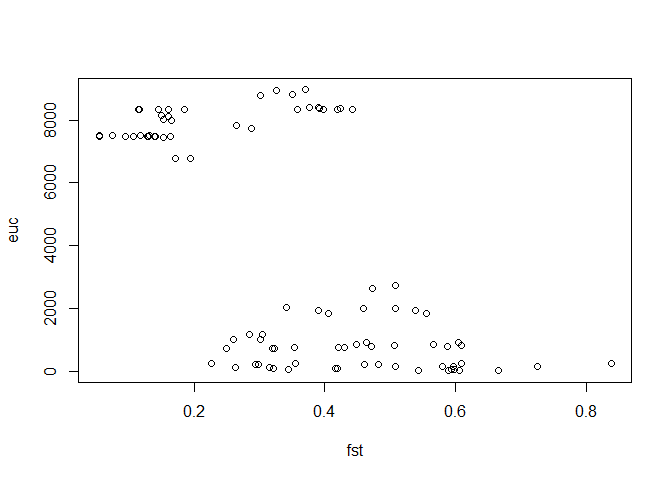

#### load libs and data

```r
library(tidyverse)
library(ecodist)
cor.tidy <- read_csv("C:/Users/Kira/Desktop/stickleback/cor_out3b_continuous_distance.csv")
```

#### randomly sample one population from those in same watershed
#### means that we go from having 23 comparisons to 14 in matrix format
#### random.org to randomly sample 1 of each pair (yup, that's how i did it)

```r
# boot	stream
# constance	lake
# geneva	lake
# joes	stream
# lq	benthic
# misty	lake
# pax	limnetic
# pri	benthic
# roberts	lake
nrow(cor.tidy)
```

```
## [1] 534
```

```r
cor.tidy <- cor.tidy[!grepl("boot_stream", cor.tidy$pop_comp),]
cor.tidy <- cor.tidy[!grepl("constance_lake", cor.tidy$pop_comp),]
cor.tidy <- cor.tidy[!grepl("geneva_lake", cor.tidy$pop_comp),]
cor.tidy <- cor.tidy[!grepl("joes_stream", cor.tidy$pop_comp),]
cor.tidy <- cor.tidy[!grepl("lq_benthic", cor.tidy$pop_comp),]
cor.tidy <- cor.tidy[!grepl("misty_lake", cor.tidy$pop_comp),]
cor.tidy <- cor.tidy[!grepl("pax_limnetic", cor.tidy$pop_comp),]
cor.tidy <- cor.tidy[!grepl("pri_benthic", cor.tidy$pop_comp),]
cor.tidy <- cor.tidy[!grepl("roberts_lake", cor.tidy$pop_comp),]
nrow(cor.tidy)
```

```
## [1] 372
```

#### get fst matrix together
#### gregs loop

```r
pops <- sort(unique(cor.tidy$pop2))

fst <- matrix(nrow = length(pops),ncol=length(pops))
for (i in 1:length(pops)){
  for (j in 1:length(pops)){
    
    tmp<- cor.tidy %>% filter(pop1 == pops[i], pop2 == pops[j]) %>% select(Correlation) %>% .$Correlation
    if (length(tmp) == 1){
      fst[i,j] <- tmp
    }

  }
}
```

```
## Warning: package 'bindrcpp' was built under R version 3.4.4
```

```r
## have to flip this matrix
## i dont know why I can't figure this out more elegantly
fst <- apply(fst, 2, rev)
fst <- t(apply(fst, 2, rev))
fst <- as.dist(fst)
```

#### get ecology matrix together
#### ordered with 3<2<1<0

```r
cor.tidy$Qual_ecology_score <- ordered(cor.tidy$Qual_ecology_score,levels=c("3","2","1","0"))
pops <- sort(unique(cor.tidy$pop2))

ecology <- matrix(nrow = length(pops),ncol=length(pops))
for (i in 1:length(pops)){
  for (j in 1:length(pops)){
    
    tmp<- cor.tidy %>% filter(pop1 == pops[i], pop2 == pops[j]) %>% select(Qual_ecology_score) %>% .$Qual_ecology_score
    if (length(tmp) == 1){
      ecology[i,j] <- tmp
    }
    
  }
}

ecology <- apply(ecology, 2, rev)
ecology <- t(apply(ecology, 2, rev))
ecology <- as.dist(ecology)
```

#### get least cost matrix together

```r
pops <- sort(unique(cor.tidy$pop2))

lcd <- matrix(nrow = length(pops),ncol=length(pops))
for (i in 1:length(pops)){
  for (j in 1:length(pops)){
    
    tmp<- cor.tidy %>% filter(pop1 == pops[i], pop2 == pops[j]) %>% select(least.cost.distance) %>% .$least.cost.distance
    if (length(tmp) == 1){
      lcd[i,j] <- tmp
    }
    
  }
}

lcd <- apply(lcd, 2, rev)
lcd <- t(apply(lcd, 2, rev))
lcd <- as.dist(lcd)
```

#### get euc dist matrix together
#### have to convert from integer to num for some reason

```r
cor.tidy$euc.distance <- as.numeric(cor.tidy$euc.distance)

pops <- sort(unique(cor.tidy$pop2))

euc <- matrix(nrow = length(pops),ncol=length(pops))
for (i in 1:length(pops)){
  for (j in 1:length(pops)){
    
    tmp<- cor.tidy %>% filter(pop1 == pops[i], pop2 == pops[j]) %>% select(euc.distance) %>% .$euc.distance
    if (length(tmp) == 1){
      euc[i,j] <- tmp
    }
    
  }
}

euc <- apply(euc, 2, rev)
euc <- t(apply(euc, 2, rev))
euc <- as.dist(euc)
```

### check out the data

```r
plot(fst,ecology)
```

<!-- -->

```r
plot(fst,lcd)
```

<!-- -->

```r
plot(fst,euc)
```

<!-- -->

```r
plot(ecology,lcd)
```

<!-- -->

```r
plot(ecology,euc)
```

<!-- -->

#### run MRM tests as well in case

```r
MRM(fst~ecology+lcd,nperm = 10000)
```

```
## $coef
##                   fst   pval
## Int      0.5476564603 0.0006
## ecology -0.0417972096 0.1033
## lcd     -0.0000141884 0.0008
## 
## $r.squared
##        R2      pval 
## 0.4200903 0.0008000 
## 
## $F.test
##        F   F.pval 
## 31.87388  0.00080
```

```r
MRM(fst~ecology+euc,nperm = 10000)
```

```
## $coef
##                   fst   pval
## Int      5.708191e-01 0.0002
## ecology -4.740297e-02 0.0568
## euc     -3.287789e-05 0.0008
## 
## $r.squared
##       R2     pval 
## 0.471113 0.001000 
## 
## $F.test
##        F   F.pval 
## 39.19357  0.00100
```

### simple mantel tests

```r
library(biotools)
```

```
## Warning: package 'biotools' was built under R version 3.4.3
```

```
## Loading required package: rpanel
```

```
## Warning: package 'rpanel' was built under R version 3.4.3
```

```
## Loading required package: tcltk
```

```
## Package `rpanel', version 1.1-3: type help(rpanel) for summary information
```

```
## 
## Attaching package: 'rpanel'
```

```
## The following object is masked from 'package:tidyr':
## 
##     population
```

```
## Loading required package: tkrplot
```

```
## Loading required package: MASS
```

```
## 
## Attaching package: 'MASS'
```

```
## The following object is masked from 'package:dplyr':
## 
##     select
```

```
## Loading required package: lattice
```

```
## Loading required package: SpatialEpi
```

```
## Warning: package 'SpatialEpi' was built under R version 3.4.3
```

```
## Loading required package: sp
```

```
## Warning: package 'sp' was built under R version 3.4.4
```

```
## ---
## biotools version 3.1
```

```
## 
```

```r
mantelTest(fst,ecology,alternative="two.sided")
```

<!-- -->

```
## 
##             Mantel's permutation test
## 
## Correlation: -0.115773
## p-value: 0.413, based on 999 matrix permutations
## Alternative hypothesis: true correlation is not equal to 0
```

```r
mantelTest(fst,lcd,alternative="two.sided")
```

<!-- -->

```
## 
##             Mantel's permutation test
## 
## Correlation: -0.6242559
## p-value: 0.001, based on 999 matrix permutations
## Alternative hypothesis: true correlation is not equal to 0
```

```r
mantelTest(fst,euc,alternative="two.sided")
```

<!-- -->

```
## 
##             Mantel's permutation test
## 
## Correlation: -0.6574665
## p-value: 0.001, based on 999 matrix permutations
## Alternative hypothesis: true correlation is not equal to 0
```
