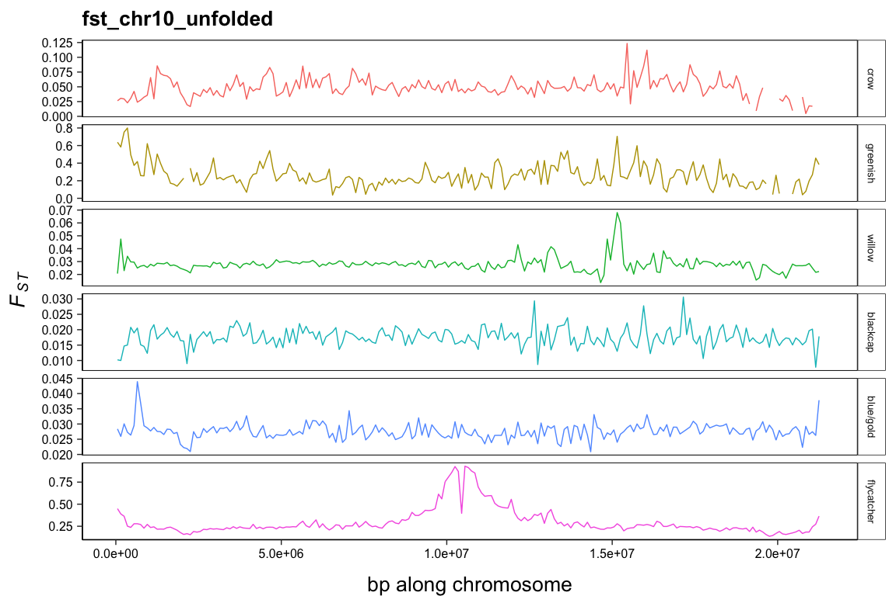
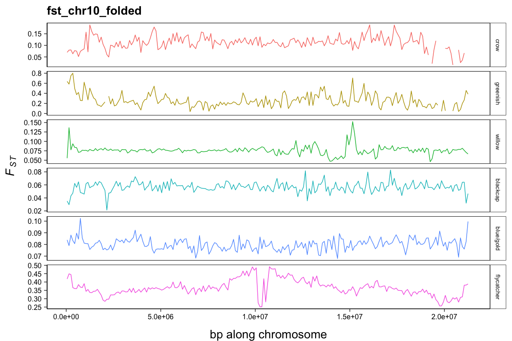
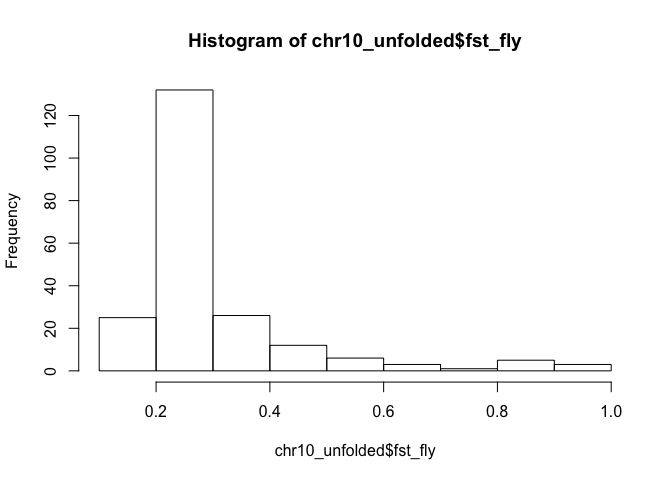
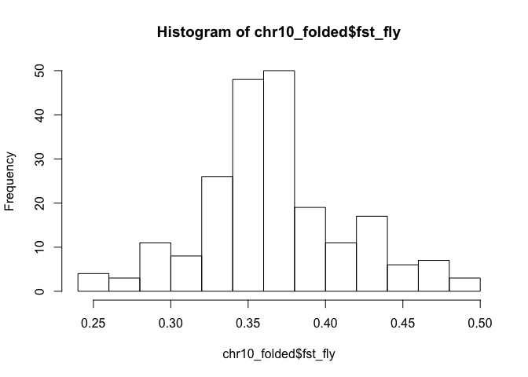
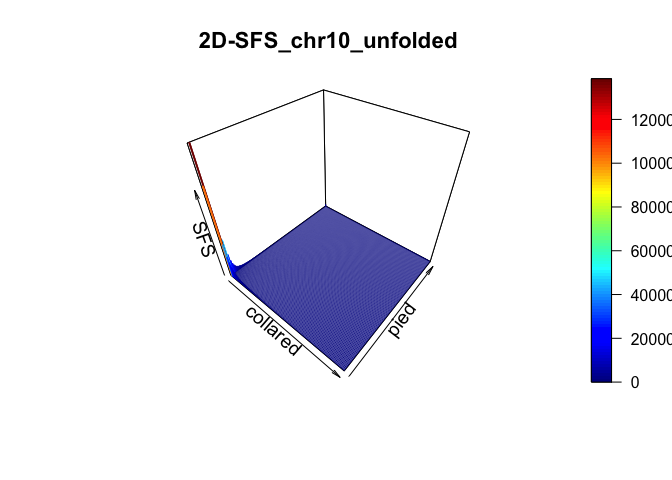
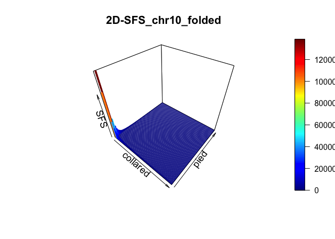

# troubleshooting_fst_angsd
kira delmore  
july 17 2017  

### load libraries

```r
setwd("~/Documents/Projects/comparative_analysis/troubleshoot_fst/")
library(plot3D)
suppressWarnings(library(plot3D))
suppressWarnings(library(ggplot2))
suppressWarnings(library(grid))
```

### load windowed (100kb) fst and limit to chr 10

```r
dat_unfolded <- read.csv("comparative_datasets_combined_100.csv")
chr10_unfolded <- subset(dat_unfolded,dat_unfolded$chr=="Chromosome_10")
dat_folded <- read.csv("comparative_datasets_combined_100_fold1.csv")
chr10_folded <- subset(dat_folded,dat_folded$chr=="Chromosome_10")
```

### plot fst along chromosome for all pairs starting with unfolded
<!-- --><!-- -->

### take closer look at flycatchers, summarizing fst and plotting histograms

```r
hist(chr10_unfolded$fst_fly)
```

<!-- -->

```r
summary(chr10_unfolded$fst_fly)
```

```
##    Min. 1st Qu.  Median    Mean 3rd Qu.    Max.    NA's 
##  0.1363  0.2233  0.2450  0.3000  0.3065  0.9303       1
```

```r
hist(chr10_folded$fst_fly)
```

<!-- -->

```r
summary(chr10_folded$fst_fly)
```

```
##    Min. 1st Qu.  Median    Mean 3rd Qu.    Max.    NA's 
##  0.2513  0.3402  0.3620  0.3659  0.3884  0.4915       1
```

### continue with flycatchers looking at sfs for chr10 starting with unfolded

```r
ANGSD.2D.SFS.UNFOLDED <- scan("CM001999.1_collared.pied.ml.unfolded")
ANGSD.2D.SFS.FOLDED <- scan("CM001999.1_collared.pied.ml.folded")
nPop1=79
nPop2=79

ANGSD.2D.SFS.UNFOLDED <- t(matrix(ANGSD.2D.SFS.UNFOLDED, nrow=((nPop1*2)+1), ncol=((nPop2*2)+1)))
ANGSD.2D.SFS.UNFOLDED[1,1] <- 0
ANGSD.2D.SFS.UNFOLDED[nrow(ANGSD.2D.SFS.UNFOLDED),ncol(ANGSD.2D.SFS.UNFOLDED)] <- 0
hist3D(x = seq(0,1,length.out = nrow(ANGSD.2D.SFS.UNFOLDED)), y = seq(0,1,length.out=ncol(ANGSD.2D.SFS.UNFOLDED)), ANGSD.2D.SFS.UNFOLDED, cex.lab=1.2, xlab="collared",ylab="pied",zlab="SFS", main=paste("2D-SFS_chr10_unfolded"),pin=c(10,0), cex.main=1.4, zlim=c(0,max(ANGSD.2D.SFS.UNFOLDED)))
```

<!-- -->

```r
ANGSD.2D.SFS.FOLDED <- t(matrix(ANGSD.2D.SFS.FOLDED, nrow=nPop1+1, ncol=nPop2+1))
ANGSD.2D.SFS.FOLDED[1,1] <- 0
ANGSD.2D.SFS.FOLDED[nrow(ANGSD.2D.SFS.FOLDED),ncol(ANGSD.2D.SFS.FOLDED)] <- 0
hist3D(x = seq(0,1,length.out = nrow(ANGSD.2D.SFS.FOLDED)), y = seq(0,1,length.out=ncol(ANGSD.2D.SFS.FOLDED)), ANGSD.2D.SFS.FOLDED, cex.lab=1.2, xlab="collared",ylab="pied",zlab="SFS", main=paste("2D-SFS_chr10_folded"),pin=c(10,0), cex.main=1.4, zlim=c(0,max(ANGSD.2D.SFS.FOLDED)))
```

<!-- -->
